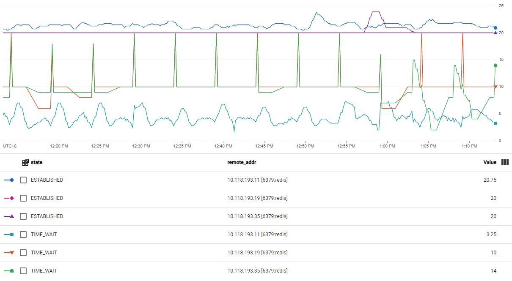

# What is Metrics-Sidecar

`Metrics-Sidecar` is a way to monitor local port usage of a pod:
- How many local ports are in use.
- How many local ports can be used totally.

`Metrics-Sidecar` runs as an extra container in pods. Since all containers share the same network space in one pod, so we can get the network information from the `Metrics-Sidecar` container. In addition, we need expose a API `/metrics` so that `Prometheus` can scrape metrics data from `Metrics-Sidecar`. The following architecture diagram shows how it works.


In order to avoid impact on the `Application` container, `Metrics-Sidecar` container NEVER exit even if it fails to get metrics, we can see those error information in its log.

# How to Use Metrics-Sidecar

Suppose that we want to monitor the port usage of an `Application` container written in any programming language. Therfore, we should perform the following steps.

## Add a Metrics Container to Target Pod

Edit `Application` workload, add an extra container using image `metrics-sidecar` which is built by this project as following, remember to replace the `<project_name>` and `<tag>` with the real repository project and tag name. Please do not set any health check probes, otherwise its health status may affect the status of `Application` container.

```
      containers:
      - image: asia.gcr.io/<project_name>/metrics-sidecar:<tag>
        imagePullPolicy: IfNotPresent
        name: metrics
        env:
        - name: METRICS_SIDECAR_PORT
          value: "9999"
        ports:
        - containerPort: 9999
        resources:
          limits:
            cpu: 50m
            memory: 50Mi
          requests:
            cpu: 50m
            memory: 50Mi
```

## Create a New Service for Metrics-Sidecar

As following, `namespace` and `selector` should be same as target `Application` service, `targetPort` is the port of metrics service, `annotations` are necessary so that `Prometheus` can scrape data from here.

```
apiVersion: v1
kind: Service
metadata:
  annotations:
    prometheus.io/path: /metrics
    prometheus.io/port: "9999"
    prometheus.io/scrape: "true"
  name: metrics
  namespace: default
spec:
  ports:
  - name: metrics
    port: 9999
    protocol: TCP
    targetPort: 9999
  selector:
    app.kubernetes.io/name: xxx
  type: ClusterIP
```

# How the Metrics Data Looks Like

There are 3 metrics related to Port Usage:
- **port_used**: How many local ports are in use.
- **port_total**: How many local ports are available totally.
- **port_usage**: Local ports in use as a percentage of total.

In addition, `port_used` are grouped by `remote addr` and `state`. There are also some connections with a temporary port number as remote port, they are counted together as `OTHER`.

The response data format complies with the requirements of `Prometheus`.

```
# HELP port_used Used Local Port Count
# TYPE port_used gauge
port_used{pod_name="<pod_name>",remote_addr="<remote_ip_0> [<remote_port_0>:<port_name_0>]",state="ESTABLISHED"} 800
port_used{pod_name="<pod_name>",remote_addr="<remote_ip_1> [<remote_port_1>:<port_name_1>]",state="TIME_WAIT"} 500
port_used{pod_name="<pod_name>",remote_addr="OTHER",state="TIME_WAIT"} 300
# HELP port_total Total Local Port Count
# TYPE port_total gauge
port_total{pod_name="<pod_name>"} 28232
# HELP port_usage Local Port Usage Percentage
# TYPE port_usage gauge
port_usage{pod_name="<pod_name>"} 5.667
```

# Create Charts for Better Viewing

If you are using GCP Monitoring, you can create a monitoring line chart to show metrics data, click [here](https://cloud.google.com/monitoring/charts/metrics-explorer) for more guidance. Finally, you can see a chart like following.



Or if you are using Grafana, following document may be helpful: https://prometheus.io/docs/visualization/grafana/
